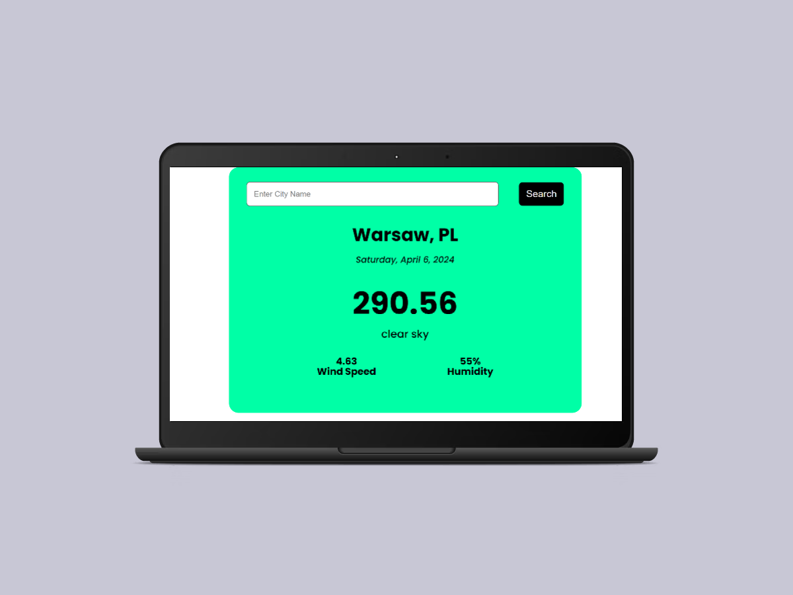

# WEATHER APP API

WeatherApp is a personal project I developed for practicing API integration. This project allowed me to hone my skills in frontend development and API utilization while creating a useful tool for accessing weather information.

## Demo

LIVE: [WEATHER APP](https://hrs-weather-app-api.netlify.app/)

## Screenshot

## Tech Stack

Yarn Vite React CSS OpenWeatherAPI

## Author

### Hubert Śleszyński

Portfolio: https://hubertsleszynski.github.io/portfolio/

Linkedin: https://www.linkedin.com/in/hubert-%C5%9Bleszy%C5%84ski-74b755231/

Github: https://github.com/HubertSleszynski
